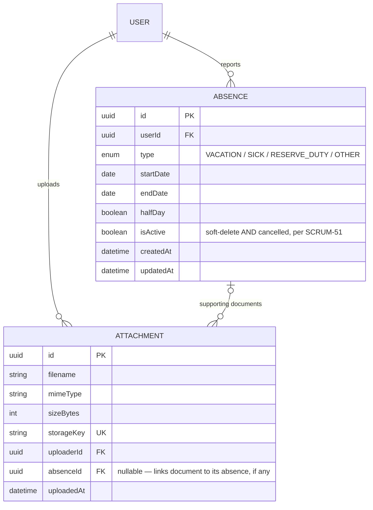

## Context

See `proposal.md` → Why. This is the schema-design subtask (SCRUM-151) of SCRUM-143, gated on team review before any migration is written.

Constraints already fixed by prior, completed work in this repo — not open for reconsideration here:

- **Prisma** is the ORM/migration tool (`backend/prisma/schema.prisma`), decided in SCRUM-44.
- **Soft delete** is a Prisma Client Extension (`backend/src/config/prisma.ts`) that rewrites `delete`/`deleteMany` to `update { isActive: false }` and injects `isActive: true` into reads for every model in `SOFT_DELETE_MODELS` (currently `User`, `Client`, `Project`, `Task`), decided in SCRUM-51.
- **Schema conventions already in force**: `id String @id @default(uuid())`; `createdAt DateTime @default(now())` / `updatedAt DateTime @updatedAt`; foreign keys named `<entity>Id` paired with a relation field; PascalCase model → `@@map("snake_case_plural")` table name; enums PascalCase type with SCREAMING_SNAKE values (e.g. `Role { ADMIN EMPLOYEE }`).
- **`Attachment` already exists** (`schema.prisma`, mapped to `attachments`): `id, filename, mimeType, sizeBytes, storageKey (unique), uploaderId -> User, uploadedAt`. Its doc-comment and the matching spec `backend-foundation/specs/backend/file-storage/spec.md` (Purpose: *"Defines how supporting documents for absence reports — sick notes and reserve-duty confirmations — are uploaded, stored, and retrieved..."*) establish that this model was built for exactly this domain, with file bytes held outside PostgreSQL behind a `FileStorage` interface. It is explicitly documented as not soft-deletable (no update/delete endpoint).
- **Frontend contract already exists**, `frontend/src/types/absence.ts`:
  ```ts
  type AbsenceType = 'vacation' | 'sick' | 'reserve_duty' | 'other'
  interface Absence {
    id: Id; userId: Id; type: AbsenceType
    startDate: ISODateString; endDate: ISODateString
    halfDay: boolean; missingDocument: boolean; cancelled: boolean
  }
  ```

## Goals / Non-Goals

**Goals:**
- Record a schema shape for absences and their supporting documents that the team can review in one pass, before a migration exists to review instead.
- Resolve — rather than carry forward — the naming collision between SCRUM-143's "status" field, the frontend's `cancelled` field, and SCRUM-51's `isActive` column.
- Decide whether absence documents get a new table or extend `Attachment`, since both the ticket text and the existing codebase point in different directions.

**Non-Goals:**
- Writing `schema.prisma`, a migration, or any application code (SCRUM-143 does this once this design is reviewed).
- Designing SCRUM-144 (working-day calculation), SCRUM-145 (conflict validation), or SCRUM-146 (month-lock) logic — only the schema properties they'll read are considered.
- Modeling the half-day "complete the remainder of the day as a work report" interaction with hours reports — no `Report`/time-entry model exists in `schema.prisma` yet either; this is a cross-entity business rule for whichever ticket implements it, not a schema concern here.
- Deciding the API-layer serialization mapping between Prisma's `SCREAMING_SNAKE` enum values and the frontend's `snake_case` string literals — noted as an open question for the implementing ticket.

## ERD

Reflects the team's decision on the "Absence documents" question below: `Attachment` is extended with a nullable `absenceId`, rather than introducing a separate table.



## Decisions

### `Absence`: one row per absence, not one row per day

```prisma
model Absence {
  id        String      @id @default(uuid())
  userId    String
  user      User        @relation(fields: [userId], references: [id])
  type      AbsenceType
  startDate DateTime    @db.Date
  endDate   DateTime    @db.Date
  halfDay   Boolean     @default(false)
  isActive  Boolean     @default(true)
  createdAt DateTime    @default(now())
  updatedAt DateTime    @updatedAt

  @@index([userId, isActive, startDate, endDate])
  @@map("absences")
}

enum AbsenceType {
  VACATION
  SICK
  RESERVE_DUTY
  OTHER
}
```

A single row with `startDate`/`endDate` matches the frontend's existing contract exactly (already singular `startDate`/`endDate`, not a list of dates). SCRUM-144 computes the Friday–Saturday exclusion from this range at read time; storing one row per calendar day would mean writing and re-validating N rows for an N-day vacation, duplicating what SCRUM-144 already owns. `@db.Date` (no time component) matches the frontend's `ISODateString` and the fact that absences are day-granular, never time-of-day.

*Alternative considered:* one row per day (`absence_id` FK + `date`), which would make "is this specific day off" a plain row lookup instead of a range check. Rejected — every consumer (SCRUM-144 working-day calc, SCRUM-145 conflict validation, SCRUM-146 month display) needs the *range* as a unit anyway (to render "Aug 10–14, vacation" as one entry, to validate against a whole new range at once), so per-day rows would mean reconstructing the range from contiguous rows everywhere they're used, for no ticket that actually wants per-day granularity.

The `@@index([userId, startDate, endDate])` supports SCRUM-145's overlap check and SCRUM-146's month-scoped lookups, both of which filter by user and a date range.

**Revised after PR #48 review:** the index above doesn't include `isActive`, but every read of this table gets `isActive: true` auto-injected by the soft-delete extension (`prisma.ts`) — so in practice every query this index is meant to serve is filtering on `isActive` too, and the index can't lead with it. Revised to `@@index([userId, isActive, startDate, endDate])`. Cheap, no behavioral change, just makes the index actually match the query shape SCRUM-145/146 will issue.

**New: date-range validity enforced by storage, not just application code.** Nothing currently stops `endDate` from being written earlier than `startDate` — a form bug or a future direct-write bug could silently produce negative-length absences and corrupt anything downstream that counts days from the range (working-day calc, conflict checks, monthly totals). Add a database-level `CHECK ("endDate" >= "startDate")` constraint so this is impossible regardless of which code path writes the row, not just the path that happens to validate it. See the new "Absence date range is valid at the storage level" requirement in `spec.md`. *Implementation note:* whether this is representable as `@@check` directly in `schema.prisma` (Prisma added check-constraint support at some point; not yet confirmed for the Prisma version this repo pins) or must be added as raw SQL appended to the migration is an implementation detail to resolve when this is actually built — either way the constraint must exist in the database.

### Type list and half-day flag

`AbsenceType` is a 4-value enum matching the frontend's union 1:1 (`vacation→VACATION`, `sick→SICK`, `reserve_duty→RESERVE_DUTY`, `other→OTHER`), following the existing `Role` enum's PascalCase-type/SCREAMING_SNAKE-value convention. `halfDay` is a plain boolean, matching the frontend field of the same name and meaning.

*Open question, not resolved here:* the API layer will need to translate between Prisma's enum values and the frontend's lowercase string literals on every read/write. This is a serialization detail for whichever ticket builds the absences API, not a schema decision.

### Soft-delete, "status", and "cancelled" are the same fact — one `isActive` column

SCRUM-143's acceptance criteria lists a "status" field on the absences table. The frontend type independently has a `cancelled: boolean`. SCRUM-51's convention is `isActive`. The spec PDF resolves this directly: *"Cancelled absences soft-deleted per SCRUM-51, never removed."* That sentence states cancellation *is* the soft-delete action, not a separate state alongside it.

Decision: `Absence` gets exactly one `isActive Boolean @default(true)` column, added to `SOFT_DELETE_MODELS` in `prisma.ts` like every other soft-deletable model. There is no separate `status` column. The API layer exposes this to the frontend as `cancelled: !isActive` — a response-shaping detail, not a second stored field.

*Alternative considered:* a dedicated `status` enum (e.g. `ACTIVE` / `CANCELLED`) distinct from `isActive`, closer to literally satisfying SCRUM-143's AC wording. Rejected: it would duplicate exactly what `isActive` already means for this entity (nothing in the spec describes a third state — no draft/pending/approved absence state exists anywhere in the PDF), and it would make `Absence` the only soft-deletable model in the schema with two overlapping deletion-state columns, which is a foot-gun (which one does a query filter on?) for no requirement that asks for it.

### Absence documents: extend `Attachment` with a nullable `absenceId`

**Decided by the team:** extend the existing `Attachment` model with `absenceId`, rather than introducing a separate `AbsenceDocument` table, and make the column **nullable**.

```prisma
model Attachment {
  id         String   @id @default(uuid())
  filename   String
  mimeType   String
  sizeBytes  Int
  storageKey String   @unique
  uploaderId String
  uploader   User     @relation(fields: [uploaderId], references: [id])
  uploadedAt DateTime @default(now())
  absenceId  String?
  absence    Absence? @relation(fields: [absenceId], references: [id])

  @@map("attachments")
}
```

`Attachment` already has the exact shape SCRUM-143's "absence_documents" AC asks for (`filename`, `mimeType`, `sizeBytes`, `storageKey`, plus an upload timestamp), and its own spec doc states it was purpose-built for absence supporting documents. Adding `absenceId` gives multi-file support for free (one `Absence` to many `Attachment` rows) and reuses the already-specified `FileStorage` interface and owner-or-admin retrieval rules verbatim — nothing new to design or implement on the storage/retrieval side.

`absenceId` is **nullable** by the team's choice, keeping `Attachment` usable for non-absence purposes later without a further schema change — an absence document itself is still expected to have one in practice (SCRUM-151's spec.md requires it: "a supporting document identifies exactly one absence it belongs to"), but the column doesn't force every `Attachment` row in the table to carry one.

*Alternative considered and rejected:* a distinct `AbsenceDocument` model — the literal reading of SCRUM-143's AC wording ("absence_documents table linked to an absence"). This would have duplicated `Attachment`'s columns, its `FileStorage` wiring, and its retrieval-permission logic in a second model with no behavioral difference from the chosen approach; `Attachment` has exactly one consumer today, so a second table bought nothing.

**Sub-decision, either way:** `missingDocument` (a field on the frontend's `Absence` type) is derived, not stored — computed as `type ∈ {SICK, RESERVE_DUTY} AND no linked document exists`. No schema column represents it.

**New, from PR #48 review: retrieval permission must extend to the absence's owner, not just the uploader.** `retrieveAttachment` (`attachment.service.ts`) currently allows only the uploader or an admin to retrieve a file — written when `Attachment` only had `uploaderId`. Now that `Attachment` can be linked to an absence, an admin uploading a sick note on an employee's behalf (a realistic scenario the PDF spec anticipates — documents can be added after the fact, "כי לעיתים האישור מתקבל בהמשך") would leave the employee, the actual owner of the absence, unable to retrieve their own supporting document. Not reachable through today's API (no endpoint yet sets `absenceId` on upload), but the authorization model should be correct before that endpoint exists, not patched after someone hits it. See the new "Absence document retrieval extends to the absence's owner" requirement in `spec.md`; the fix is to also permit the caller when they own the linked absence (`attachment.absence.userId === caller.id`), alongside the existing uploader-or-admin check.

## Risks / Trade-offs

**Extending `Attachment` couples two domains (generic file storage, absences) in one table.** A nullable `absenceId` keeps the door open for non-absence attachments later, but nothing currently enforces that an absence document's `absenceId` is actually set — that constraint lives in application code (the absence-document upload path), not the schema. Mitigation: SCRUM-151's spec.md already states the requirement ("a supporting document identifies exactly one absence"); whichever ticket implements the upload endpoint should validate it there.

**Single `isActive` column means "cancelled" and "soft-deleted" can never diverge.** If a future requirement needs to distinguish "employee cancelled this" from "admin removed this in error," one column can't carry both. Mitigation: nothing in the current spec asks for that distinction; if it appears later, it's an additive column, not a rework of this design.

**No stored `Report` reference for the half-day "complete the remainder of the day" rule.** SCRUM-149 will need to correlate a half-day absence with the work-hours report for the rest of that day, and no schema relation exists between them here. Mitigation: this is a same-user-same-date correlation the application layer can do without a foreign key (both entities carry `userId` and a date); a stronger relation can be added later if the correlation proves error-prone in practice.

**New, from PR #48 review: the soft-delete extension doesn't cover every query shape.** `softDeleteExtension` (`prisma.ts`) intercepts `findMany`/`findFirst`/`findUnique`/`count`/`delete`/`deleteMany`, but not `aggregate`, `groupBy`, or records reached through a nested `include`/`select` on a relation. This predates this change (it's already true for `User`/`Client`/`Project`/`Task`), but `Absence` is the first place it becomes practically reachable through a real user-facing relation — a future "total vacation days this month" aggregate could silently count cancelled absences. Split into two responses, not one: (1) extending the interception to `aggregate`/`groupBy` is cheap and uniform across all five soft-deletable models — do it now, tracked in `tasks.md`, and covered by the new "Cancelled absences are excluded from aggregate views by default" requirement in `spec.md`. (2) Filtering through nested `include`/`select` is a materially larger change (relation-level query rewriting, project-wide, not absences-specific) — explicitly deferred, not fixed in this change; noted here so it isn't forgotten rather than fixed speculatively.

## Code Review Follow-Ups (PR #48)

Three items above now have corresponding requirements in `spec.md` (date-range validity, absence-owner document retrieval, aggregate soft-delete exclusion) and will be implemented against those requirements. Four more are implementation/tooling quality items with no externally observable behavior to spec, tracked directly in `tasks.md` instead:

- Seed fixture comment (`seed.ts`) claims a "Fri–Sat weekend" range that's actually Thu–Sun (4 days, 2 of them weekdays) — misleading for whoever builds SCRUM-144 against it as a fixture.
- No `createAbsence()` test factory in `factories.ts`, breaking the pattern every other soft-deletable model follows.
- Six near-identical seed blocks for the sample absences could be a data array + loop instead of copy-paste.

## Migration Plan

No migration in this change — it is explicitly deferred to SCRUM-143 pending review of this design (per SCRUM-151's own description: "Settle the shape before any migration is written"). When SCRUM-143 proceeds:

1. Add `AbsenceType` enum and `Absence` model to `schema.prisma`.
2. Extend `Attachment` with a nullable `absenceId`.
3. Add `Absence` to `SOFT_DELETE_MODELS` in `backend/src/config/prisma.ts`.
4. Run `prisma migrate dev` to generate the migration; no data backfill needed (greenfield table).

## Open Questions

- **Enum/string serialization mapping** between Prisma's `AbsenceType` values and the frontend's lowercase literals — belongs to the ticket that builds the absences API.
- **Half-day ↔ hours-report correlation** — deferred to whichever ticket implements SCRUM-149, once a `Report`/time-entry schema exists to correlate against.
